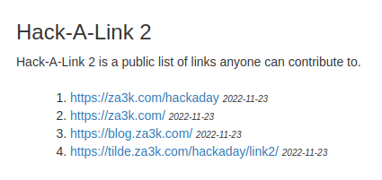

Hack-A-Day is a project I'm doing in November, where I try to make 30 new projects, in 30 days.

# Day 23: Hack-A-Link 2

A public directory of links, in the style of 1990 internet.

Demo available [here](https://tilde.za3k.com/hackaday/link2).

Source available on [github](https://github.com/za3k/day23_link2).
